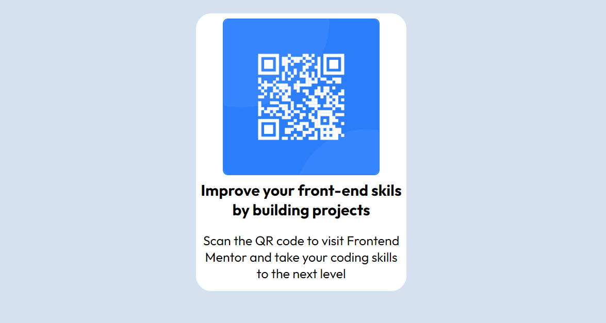

# Product Preview Card Component

 

## :memo: Descrição do Projeto

Projeto simples que consiste em uma página contendo um QRCODE.

## [Acessar site](https://matheusfeliperuiz.github.io/QrcodePage/)

##  Desenvolvido com: 

 <strong> HTML</strong>
 <strong>CSS</strong>
